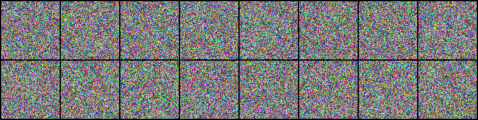

# ddpm-Anime-Face
简单的使用扩散模型生成动漫脸

## 数据下载地址
数据介绍：图片的尺寸均为96x96

链接：https://pan.baidu.com/s/1FfbFNtz1XzTR3Ow6SOlKZw 

提取码：902B
## 训练好的权重下载地址
链接：https://pan.baidu.com/s/1QvlchuOyi8VwHizWUkNuWw 

提取码：902B

## 训练结果展示
噪音图

生成图

$\color{red}{环境需要ddpm，自行打包ddpm的环境}$

